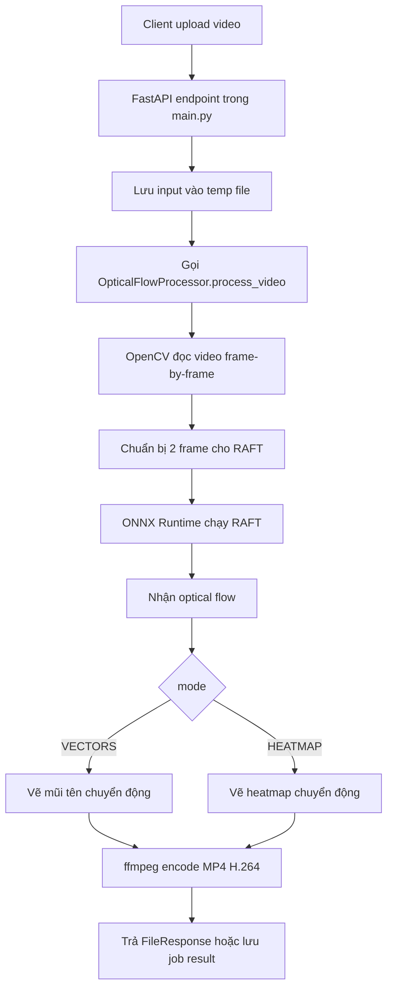

# Optical Flow Server - Tài liệu code và API

Tài liệu này mô tả server FastAPI trong repo, các endpoint API, nơi xử lý từng phần trong code, vai trò của model RAFT ONNX, và luồng xử lý video từ lúc client upload đến lúc nhận file MP4 kết quả.

## 1. Tổng quan

Project này là một server xử lý video bằng optical flow.

Client upload một video MP4 lên API. Server đọc video từng frame, dùng model RAFT ONNX để ước lượng chuyển động giữa hai frame, rồi render kết quả thành video MP4 mới theo một trong hai chế độ:

- `VECTORS`: vẽ mũi tên chuyển động lên frame.
- `HEATMAP`: phủ heatmap biểu diễn cường độ chuyển động lên frame.

Server hỗ trợ hai kiểu xử lý:

- Đồng bộ: gọi `POST /process-video`, request giữ mở cho đến khi video xử lý xong.
- Bất đồng bộ theo job: gọi `POST /process-video/jobs`, lấy `job_id`, poll trạng thái, rồi tải kết quả sau. Kiểu này phù hợp hơn khi chạy qua Cloudflare Tunnel hoặc video xử lý lâu.

## 2. Cấu trúc repo

```text
OpticalFlowServer/
├── main.py
├── inference.py
├── optical_flow_estimation_raft_2023aug.onnx
├── requirements.txt
├── README.md
├── temp_videos/
└── __pycache__/
```

Vai trò các file chính:

| File | Vai trò |
| --- | --- |
| `main.py` | Khởi tạo FastAPI app, load model, khai báo API endpoint, quản lý job async, cleanup file tạm. |
| `inference.py` | Chứa pipeline xử lý video: đọc frame bằng OpenCV, chạy ONNX Runtime, vẽ vector/heatmap, encode MP4 H.264 bằng ffmpeg. |
| `optical_flow_estimation_raft_2023aug.onnx` | File model RAFT ONNX đang có trong repo. |
| `requirements.txt` | Dependency Python: FastAPI, Uvicorn, ONNX Runtime, OpenCV, NumPy, ffmpeg helper. |
| `README.md` | Ghi chú chạy server và Cloudflare Tunnel. |
| `temp_videos/` | Có thể chứa file status JSON theo `job_id` khi xử lý async. |

## 3. Dependency

Các dependency hiện tại trong `requirements.txt`:

```text
fastapi==0.110.0
uvicorn==0.27.1
python-multipart==0.0.9
onnxruntime==1.26.0
opencv-python==4.9.0.80
numpy==1.26.4
imageio-ffmpeg==0.5.1
```

Ý nghĩa chính:

- `fastapi`, `uvicorn`: chạy HTTP API server.
- `python-multipart`: giúp FastAPI nhận upload file qua `multipart/form-data`.
- `onnxruntime`: chạy model ONNX RAFT.
- `opencv-python`: đọc video, resize frame, vẽ overlay.
- `numpy`: xử lý tensor, flow field, percentile, magnitude.
- `imageio-ffmpeg`: cung cấp ffmpeg binary để encode MP4 H.264 ổn định hơn.

## 4. Chạy server

Cài dependency:

```powershell
pip install -r requirements.txt
```

Chạy API server:

```powershell
uvicorn main:app --host 0.0.0.0 --port 8000
```

FastAPI tự có docs ở:

- `http://localhost:8000/docs`
- `http://localhost:8000/redoc`

Health check:

```powershell
curl.exe http://localhost:8000/health
```

## 5. Biến môi trường

| Biến | Default | Ý nghĩa |
| --- | --- | --- |
| `OPTICAL_FLOW_LOG_LEVEL` | `INFO` | Log level cho `main.py` và `inference.py`. |
| `OPTICAL_FLOW_MAX_CONCURRENT_VIDEO_JOBS` | `3` | Số job async được xử lý song song tối đa. |
| `OPTICAL_FLOW_MAX_PENDING_VIDEO_JOBS` | `8` | Tổng số job đang queue hoặc processing tối đa. |

Ví dụ:

```powershell
$env:OPTICAL_FLOW_LOG_LEVEL="DEBUG"
$env:OPTICAL_FLOW_MAX_CONCURRENT_VIDEO_JOBS="2"
$env:OPTICAL_FLOW_MAX_PENDING_VIDEO_JOBS="6"
uvicorn main:app --host 0.0.0.0 --port 8000
```

## 6. Model RAFT là gì và server dùng nó làm gì?

RAFT là model optical flow. Optical flow là bài toán ước lượng chuyển động biểu kiến giữa hai frame liên tiếp hoặc gần nhau trong video. Kết quả thường là một field 2 chiều, trong đó mỗi điểm có vector `(u, v)`:

- `u`: độ dịch chuyển theo trục ngang.
- `v`: độ dịch chuyển theo trục dọc.

Trong repo này, RAFT không được training trong code. Server chỉ load file ONNX đã export sẵn và chạy inference bằng ONNX Runtime.

Vai trò cụ thể của RAFT trong server:

1. Nhận hai frame ảnh làm input.
2. Ước lượng optical flow giữa hai frame.
3. Trả ra tensor flow.
4. Code trong `inference.py` chuyển flow đó thành hình ảnh dễ nhìn:
   - `VECTORS`: vẽ các mũi tên theo hướng/chuyển động.
   - `HEATMAP`: tô màu vùng có chuyển động mạnh.

RAFT không làm các việc sau:

- Không detect object.
- Không segment người/xe/vật thể.
- Không phân loại hành động.
- Không tracking ID object qua nhiều frame.
- Không tự quyết định camera đang tiến/lùi. API nhận tham số `is_moving` hoặc `isMoving` để quyết định chiều mũi tên khi vẽ vector.

## 7. Load model ở đâu?

Model được chọn và load trong `main.py`.

Các tên model được code ưu tiên:

```python
DEFAULT_MODEL = "optical_flow_estimation_raft_2023aug_int8bq.onnx"
DEQUANT_MODEL = "optical_flow_estimation_raft_2023aug_dequant.onnx"
ALT_MODEL = "optical_flow_estimation_raft_2023aug.onnx"
```

Thứ tự ưu tiên:

1. Nếu có `optical_flow_estimation_raft_2023aug_dequant.onnx` thì dùng file này.
2. Nếu không có, nhưng có `optical_flow_estimation_raft_2023aug.onnx` thì dùng file này.
3. Nếu không có hai file trên, fallback sang `optical_flow_estimation_raft_2023aug_int8bq.onnx`.

Trong repo hiện tại có `optical_flow_estimation_raft_2023aug.onnx`, nên server sẽ chọn file này nếu không có file dequant.

Sau khi chọn path, `main.py` tạo:

```python
processor = OpticalFlowProcessor(MODEL_PATH)
```

Class `OpticalFlowProcessor` nằm trong `inference.py`. Tại đây model được load bằng:

```python
self.session = ort.InferenceSession(self.model_path, providers=['CUDAExecutionProvider', 'CPUExecutionProvider'])
```

Nếu CUDA provider lỗi hoặc không khả dụng, code fallback sang provider mặc định của ONNX Runtime, thường là CPU.

## 8. Luồng xử lý tổng quát



## 9. API endpoints

### 9.1 `GET /health`

Code xử lý: `health_check()` trong `main.py`.

Mục đích:

- Kiểm tra server còn chạy.
- Kiểm tra model đã load chưa.
- Xem thống kê job async.

Response ví dụ:

```json
{
  "status": "ok",
  "model_loaded": true,
  "video_jobs": {
    "queued": 0,
    "processing": 0,
    "pending": 0,
    "completed": 0,
    "failed": 0,
    "cancelled": 0,
    "total": 0,
    "max_concurrent": 3,
    "max_pending": 8
  }
}
```

### 9.2 `POST /process-video`

Code xử lý: `process_video()` trong `main.py`.

Đây là endpoint xử lý đồng bộ. Client upload video và đợi server xử lý xong rồi nhận MP4 kết quả trong cùng request.

Form fields:

| Field | Type | Required | Default | Ý nghĩa |
| --- | --- | --- | --- | --- |
| `file` | file | Có | Không có | Video input. Code lưu thành temp `.mp4`. |
| `mode` | string | Không | `VECTORS` | `VECTORS`, `VECTOR`, hoặc `HEATMAP`. `VECTOR` được normalize thành `VECTORS` trong `inference.py`. |
| `is_moving` | bool | Không | `false` | Snake case. Ảnh hưởng chiều mũi tên trong mode `VECTORS`. |
| `isMoving` | bool | Không | `false` | Camel case cho client như Android/Kotlin. Nếu có cả hai, `is_moving` được ưu tiên. |

Response thành công:

- `Content-Type`: `video/mp4`
- Body là file MP4 đã xử lý.

Response lỗi:

```json
{
  "error": "message"
}
```

Lưu ý: endpoint sync hiện trả JSON lỗi trực tiếp trong một số trường hợp thay vì raise `HTTPException`.

Ví dụ gọi bằng PowerShell:

```powershell
curl.exe -X POST "http://localhost:8000/process-video" `
  -F "file=@C:\path\input.mp4" `
  -F "mode=VECTORS" `
  -F "isMoving=true" `
  --output output_vectors.mp4
```

Ví dụ HEATMAP:

```powershell
curl.exe -X POST "http://localhost:8000/process-video" `
  -F "file=@C:\path\input.mp4" `
  -F "mode=HEATMAP" `
  --output output_heatmap.mp4
```

### 9.3 `POST /process-video/jobs`

Code xử lý: `create_process_video_job()` trong `main.py`.

Đây là endpoint xử lý bất đồng bộ. Client upload video, server tạo job và trả `job_id` ngay. Việc xử lý video chạy sau response bằng `BackgroundTasks`.

Form fields giống `POST /process-video`:

| Field | Type | Required | Default |
| --- | --- | --- | --- |
| `file` | file | Có | Không có |
| `mode` | string | Không | `VECTORS` |
| `is_moving` | bool | Không | `false` |
| `isMoving` | bool | Không | `false` |

Response thành công có status code `202`:

```json
{
  "job_id": "7e6f3d4d4f6a4e0b9e7f9a4a7b9e2f11",
  "status": "queued",
  "queue": {
    "queued": 1,
    "processing": 0,
    "pending": 1,
    "completed": 0,
    "failed": 0,
    "cancelled": 0,
    "total": 1,
    "max_concurrent": 3,
    "max_pending": 8
  }
}
```

Lỗi có thể gặp:

- `503`: model không load được.
- `429`: queue đầy, tức `pending >= OPTICAL_FLOW_MAX_PENDING_VIDEO_JOBS`.

Ví dụ:

```powershell
$job = curl.exe -X POST "http://localhost:8000/process-video/jobs" `
  -F "file=@C:\path\input.mp4" `
  -F "mode=VECTORS" `
  -F "isMoving=true" | ConvertFrom-Json

$job.job_id
```

### 9.4 `GET /process-video/jobs/{job_id}`

Code xử lý: `get_process_video_job()` trong `main.py`.

Mục đích: lấy trạng thái job.

Response ví dụ:

```json
{
  "job_id": "7e6f3d4d4f6a4e0b9e7f9a4a7b9e2f11",
  "status": "processing",
  "mode": "VECTORS",
  "is_moving": true,
  "progress": 45,
  "error": null
}
```

Các field nội bộ sau bị ẩn khỏi response:

- `input_path`
- `output_path`
- `cancel_requested`

Các trạng thái job:

| Status | Ý nghĩa |
| --- | --- |
| `queued` | Job đã tạo, đang chờ slot xử lý. |
| `processing` | Job đang chạy RAFT/video pipeline. |
| `cancelling` | Client đã yêu cầu cancel, pipeline đang chờ điểm kiểm tra để dừng. |
| `completed` | Xử lý xong, có thể tải kết quả. |
| `failed` | Xử lý lỗi. Xem field `error`. |
| `cancelled` | Job đã bị hủy. |

Ví dụ poll:

```powershell
curl.exe "http://localhost:8000/process-video/jobs/$($job.job_id)"
```

### 9.5 `GET /process-video/jobs/{job_id}/result`

Code xử lý: `get_process_video_job_result()` trong `main.py`.

Mục đích: tải video kết quả của job async.

Điều kiện:

- Job phải tồn tại.
- `status` phải là `completed`.
- File output vẫn còn tồn tại.

Response thành công:

- `Content-Type`: `video/mp4`
- Body là file MP4 kết quả.

Sau khi trả result, server schedule cleanup:

- Xóa file output.
- Xóa metadata job khỏi `video_jobs`.

Lỗi có thể gặp:

| HTTP status | Khi nào |
| --- | --- |
| `404` | Không tìm thấy `job_id`. |
| `409` | Job chưa completed. |
| `500` | Job failed. |
| `410` | Job completed nhưng file output không còn tồn tại. |

Ví dụ:

```powershell
curl.exe "http://localhost:8000/process-video/jobs/$($job.job_id)/result" --output output.mp4
```

### 9.6 `POST /process-video/jobs/{job_id}/cancel`

Code xử lý: `cancel_process_video_job()` trong `main.py`.

Mục đích: yêu cầu hủy job async.

Behavior:

- Nếu job đang `queued`: chuyển sang `cancelled`.
- Nếu job đang `processing`: chuyển sang `cancelling`, pipeline sẽ dừng tại lần check cancel tiếp theo.
- Nếu job đã `completed`: chuyển sang `cancelled` và cleanup file.
- Nếu không có job: trả `404`.

Ví dụ:

```powershell
curl.exe -X POST "http://localhost:8000/process-video/jobs/$($job.job_id)/cancel"
```

## 10. `main.py` xử lý gì?

`main.py` là layer API và orchestration.

Các phần chính:

### 10.1 Logging

Code đọc biến:

```python
LOG_LEVEL = os.getenv("OPTICAL_FLOW_LOG_LEVEL", "INFO").upper()
```

Rồi cấu hình logging cho:

- `optical_flow.server`
- `optical_flow`

`inference.py` dùng logger `optical_flow.inference`.

### 10.2 FastAPI app và CORS

```python
app = FastAPI(title="Optical Flow Server")
```

CORS hiện đang mở:

```python
allow_origins=["*"]
allow_methods=["*"]
allow_headers=["*"]
```

Điều này tiện cho dev/mobile client, nhưng nếu public server thật thì nên giới hạn origin.

### 10.3 Model processor singleton

`main.py` load model một lần khi import app:

```python
processor = OpticalFlowProcessor(MODEL_PATH)
```

Tất cả endpoint dùng chung object `processor`.

Nếu load model lỗi:

```python
processor = None
```

Khi đó:

- Sync endpoint trả `{"error": "Model not loaded on server."}`.
- Async endpoint trả `503`.
- `/health` trả `"model_loaded": false`.

### 10.4 `VideoJob`

Dataclass trong `main.py`:

```python
@dataclass
class VideoJob:
    job_id: str
    status: str
    input_path: str
    output_path: str
    mode: str
    is_moving: bool
    progress: int = 0
    error: Optional[str] = None
    cancel_requested: bool = False
```

Ý nghĩa:

- `job_id`: UUID hex trả cho client.
- `status`: trạng thái job.
- `input_path`: file upload tạm trên disk.
- `output_path`: file MP4 output tạm trên disk.
- `mode`: `VECTORS` hoặc `HEATMAP`.
- `is_moving`: quyết định chiều vector khi render `VECTORS`.
- `progress`: phần trăm xử lý.
- `error`: thông báo lỗi/cancel.
- `cancel_requested`: cờ nội bộ để pipeline dừng.

### 10.5 Job storage

Job được lưu trong memory:

```python
video_jobs = {}
video_jobs_lock = threading.Lock()
```

Hệ quả:

- Restart server sẽ mất toàn bộ job state.
- Không phù hợp nếu chạy nhiều process Uvicorn worker vì mỗi process có memory riêng.
- Output file chỉ được quản lý bởi process hiện tại.

### 10.6 Giới hạn concurrent job

Code dùng semaphore:

```python
video_job_slots = threading.Semaphore(MAX_CONCURRENT_VIDEO_JOBS)
```

`run_video_job()` sẽ chờ slot trước khi xử lý. Nếu job bị cancel trong lúc chờ slot, job được chuyển sang `cancelled`.

Queue limit tính theo:

```python
pending = queued + processing
```

Trong đó `processing` bao gồm cả `processing` và `cancelling`.

### 10.7 Cleanup file tạm

Hàm:

```python
cleanup_files(file_paths)
```

Dùng để xóa input/output temp file sau khi:

- Sync response đã gửi xong.
- Async job failed/cancelled.
- Client tải result xong.

Input file của async job được cleanup trong `finally` của `run_video_job()`.

## 11. `inference.py` xử lý gì?

`inference.py` là layer video processing và model inference.

Các class/function chính:

| Thành phần | Vai trò |
| --- | --- |
| `ProcessingCancelled` | Exception riêng để dừng pipeline khi client cancel job. |
| `H264Mp4Writer` | Ghi frame BGR sang MP4 H.264 bằng ffmpeg subprocess. |
| `OpticalFlowProcessor` | Load ONNX model, chạy inference, vẽ vector/heatmap, xử lý video. |

## 12. `H264Mp4Writer`

Class này encode output video thành MP4 H.264 tương thích Android/browser tốt hơn so với `cv2.VideoWriter` mặc định.

Nơi dùng:

```python
out = H264Mp4Writer(output_video_path, fps, width, height, req_id=req_id).open()
```

### 12.1 Chọn ffmpeg

Thứ tự:

1. Nếu import được `imageio_ffmpeg`, dùng `imageio_ffmpeg.get_ffmpeg_exe()`.
2. Nếu không, tìm `ffmpeg` trong `PATH`.
3. Nếu không có, raise lỗi yêu cầu cài ffmpeg hoặc `pip install -r requirements.txt`.

### 12.2 Cấu hình output

Các option ffmpeg chính:

- Input raw video từ `stdin`.
- Pixel format input: `bgr24`.
- Scale để width/height là số chẵn:
  - `scale=trunc(iw/2)*2:trunc(ih/2)*2`
- Convert sang `yuv420p`.
- Codec: `libx264`.
- Preset: `veryfast`.
- CRF: `23`.
- Profile: `main`.
- `-movflags +faststart`: giúp MP4 stream/play sớm hơn.
- Output FPS bị giới hạn tối đa `30`.

### 12.3 Cancel writer

Nếu job bị cancel, `out.cancel()` sẽ:

- Đóng stdin nếu có.
- Terminate ffmpeg process.
- Nếu terminate quá lâu thì kill process.

## 13. `OpticalFlowProcessor`

Đây là class quan trọng nhất trong `inference.py`.

### 13.1 Khởi tạo

Constructor:

```python
def __init__(self, model_path: str):
```

Việc chính:

1. Load ONNX model bằng ONNX Runtime.
2. Ưu tiên CUDA provider, fallback CPU.
3. Chọn output index chứa optical flow bằng `select_flow_output_index()`.
4. Set kích thước input RAFT:
   - `input_width = 480`
   - `input_height = 360`
5. Set khoảng cách frame:
   - `flow_frame_offset = 3`
6. Set tham số render vector/heatmap.

### 13.2 `select_flow_output_index()`

Một số ONNX model có nhiều output. Hàm này chọn output giống optical flow nhất.

Logic:

- Duyệt metadata output.
- Ưu tiên tensor có shape chứa 2 channel flow, ví dụ:
  - `(N, 2, H, W)`
  - `(N, H, W, 2)`
  - `(2, H, W)`
  - `(H, W, 2)`
- Nếu có nhiều output phù hợp, chọn output có `H * W` lớn nhất.
- Nếu không detect được, fallback output cuối.

### 13.3 `prepare_blob()`

Hàm chuẩn bị frame trước khi đưa vào model.

Input OpenCV frame là BGR. Code làm:

1. Convert BGR sang RGB.
2. Resize về `480x360`.
3. Cast sang `float32`.
4. Đổi layout từ HWC sang CHW.
5. Thêm batch dimension: `(1, C, H, W)`.

Code hiện không normalize pixel về `[0, 1]` và không subtract mean/std. Nó đưa giá trị float32 theo thang pixel gốc `0..255`.

### 13.4 `infer()`

Hàm chạy RAFT cho một cặp frame:

```python
def infer(self, prev_frame, curr_frame):
```

Luồng:

1. Gọi `prepare_blob(prev_frame)`.
2. Gọi `prepare_blob(curr_frame)`.
3. Đọc metadata input của ONNX session.
4. Tạo `feed` tương thích với model:
   - Nếu model có 2 input: feed frame trước và frame hiện tại vào 2 input.
   - Nếu model có 1 input: concat hai frame theo channel.
   - Hỗ trợ cả layout NCHW và NHWC.
5. Chạy:
   - `self.session.run(None, feed)`
6. Chọn và postprocess output flow bằng `postprocess_flow()`.

Nếu inference lỗi, exception sẽ kèm:

- Metadata input của model.
- Shape tensor đã feed vào model.

### 13.5 `postprocess_flow()` và `extract_flow_channels()`

Các hàm này làm code chịu được nhiều layout output khác nhau.

Output flow cuối cùng được đưa về dạng có thể tách thành:

- `u`: horizontal flow.
- `v`: vertical flow.

Các shape được hỗ trợ:

- `(N, 2, H, W)`
- `(N, H, W, 2)`
- `(2, H, W)`
- `(H, W, 2)`

Nếu shape không hỗ trợ, code log warning và trả frame gốc thay vì crash ở bước vẽ.

## 14. Xử lý video trong `process_video()`

Hàm:

```python
def process_video(
    self,
    input_video_path,
    output_video_path,
    mode="VECTORS",
    vector_direction_sign=-1.0,
    req_id: str = None,
    progress_callback=None,
    cancel_callback=None,
):
```

Đây là pipeline chính.

### 14.1 Normalize mode

```python
mode = (mode or "VECTORS").upper()
if mode == "VECTOR":
    mode = "VECTORS"
if mode not in ("VECTORS", "HEATMAP"):
    mode = "VECTORS"
```

Nếu client gửi mode lạ, server default về `VECTORS`.

### 14.2 Progress và cancel

Nếu `req_id` khác `None`, code tạo file:

```text
temp_videos/{req_id}_status.json
```

Nội dung:

```json
{
  "percent": 45
}
```

Ngoài file JSON này, async API còn cập nhật progress trong memory qua callback từ `main.py`.

Cancel được kiểm tra nhiều lần trong pipeline bằng `cancel_callback`. Khi callback trả `true`, code raise `ProcessingCancelled`.

### 14.3 Đọc video

OpenCV mở video:

```python
cap = cv2.VideoCapture(input_video_path)
```

Code đọc:

- FPS.
- Tổng số frame.
- Frame đầu tiên.
- Width/height.

Nếu FPS metadata invalid, fallback `30.0`.

### 14.4 Frame offset 3

Code không chạy flow giữa hai frame sát nhau ngay lập tức. Nó dùng:

```python
self.flow_frame_offset = 3
```

Tức là flow được ước lượng giữa:

- `source_frame = frame_buffer[0]`
- `comparison_frame = frame_buffer[-1]`

khi buffer đã có hơn 3 frame.

Ví dụ:

- Frame 1 so với frame 4.
- Frame 2 so với frame 5.
- Frame 3 so với frame 6.

Lý do ghi trong comment code: match OpenCV Zoo demo, estimate flow across a 3-frame gap, nhưng vẫn giữ số frame output bằng số frame input.

Cuối video, các frame còn lại trong buffer được ghi ra output không overlay flow.

### 14.5 Với mỗi frame được xử lý

Mỗi vòng xử lý chính:

1. Lấy `source_frame` và `comparison_frame`.
2. Gọi:
   ```python
   flow_output = self.infer(source_frame, comparison_frame)
   ```
3. Nếu `mode == "HEATMAP"`:
   ```python
   result_frame = self.draw_heatmap(flow_output, source_frame, ...)
   ```
4. Nếu mode còn lại:
   ```python
   result_frame = self.draw_vectors(flow_output, source_frame, vector_direction_sign, ...)
   ```
5. Ghi frame output:
   ```python
   out.write(result_frame)
   ```
6. Cập nhật progress mỗi 5 frame nếu biết `total_frames`.

## 15. Render mode `VECTORS`

Hàm:

```python
draw_vectors(flow, frame, vector_direction_sign=-1.0, job_id=None, frame_index=None)
```

Mục tiêu: vẽ mũi tên optical flow lên frame.

Luồng chính:

1. Tách flow thành `u`, `v`.
2. Scale flow từ kích thước model về kích thước frame gốc:
   - `x_scale = frame_w / flow_w`
   - `y_scale = frame_h / flow_h`
3. Tạo grid lấy mẫu trên frame.
4. Lấy flow tại từng điểm grid.
5. Tính magnitude:
   - `sqrt(fx^2 + fy^2)`
6. Lọc vector yếu bằng percentile.
7. Đổi chiều vector bằng `vector_direction_sign`.
8. Clamp độ dài hiển thị để mũi tên không quá ngắn/quá dài.
9. Tô màu mũi tên bằng Turbo colormap.
10. Vẽ shadow layer rồi vẽ mũi tên và dot gốc.

Các tham số render chính:

```python
self.draw_step = 34
self.min_motion_magnitude = 0.45
self.dot_radius = 2
self.vector_length_multiplier = 2.4
self.min_display_vector_length = 10.0
self.max_display_vector_length = 56.0
self.vector_activity_percentile = 58.0
self.vector_peak_percentile = 95.0
self.vector_shadow_alpha = 0.42
```

### `is_moving` ảnh hưởng gì?

Trong `main.py`:

```python
def vector_direction_sign_for_motion(is_moving: bool) -> float:
    return 1.0 if is_moving else -1.0
```

Nếu client gửi:

- `is_moving=true` hoặc `isMoving=true`: `vector_direction_sign = 1.0`
- Không gửi hoặc gửi `false`: `vector_direction_sign = -1.0`

Giá trị này chỉ ảnh hưởng mode `VECTORS`. Mode `HEATMAP` dùng magnitude nên không quan tâm hướng vector.

## 16. Render mode `HEATMAP`

Hàm:

```python
draw_heatmap(flow, frame, job_id=None, frame_index=None)
```

Mục tiêu: tô màu vùng có chuyển động mạnh.

Luồng chính:

1. Tách flow thành `u`, `v`.
2. Scale flow về kích thước frame gốc.
3. Tính magnitude:
   - `sqrt(fx^2 + fy^2)`
4. Gaussian blur magnitude để heatmap mượt hơn.
5. Lọc vùng chuyển động yếu.
6. Tính floor và peak bằng percentile.
7. Normalize magnitude về `0..1`.
8. Apply gamma để tăng độ nhìn.
9. Convert sang `uint8 0..255`.
10. Apply `cv2.COLORMAP_TURBO`.
11. Resize heatmap về kích thước frame gốc.
12. Alpha blend heatmap lên frame nền đã làm tối nhẹ.

Các tham số chính:

```python
self.heatmap_peak_percentile = 98.5
self.heatmap_floor_percentile = 45.0
self.heatmap_gamma = 0.68
self.heatmap_max_alpha = 0.78
self.heatmap_background_weight = 0.72
self.heatmap_min_alpha = 0.08
```

## 17. Async job hoạt động như thế nào?

Luồng async:

1. Client gọi `POST /process-video/jobs`.
2. Server kiểm tra model đã load chưa.
3. Server kiểm tra queue có đầy không.
4. Server lưu upload vào temp input file.
5. Server tạo temp output file.
6. Server tạo `VideoJob` với status `queued`.
7. Server lưu job vào dict `video_jobs`.
8. Server add background task:
   ```python
   background_tasks.add_task(run_video_job, job_id)
   ```
9. Client nhận `job_id`.
10. `run_video_job()` chờ semaphore slot.
11. Khi có slot, status chuyển sang `processing`.
12. `processor.process_video()` chạy inference.
13. Progress callback cập nhật `job.progress`.
14. Nếu xong, status chuyển sang `completed`.
15. Client gọi `/result` để lấy file.

Lưu ý: `BackgroundTasks` của FastAPI/Starlette chạy trong cùng process server, không phải queue worker độc lập như Celery/RQ. Nếu server process chết, job đang chạy mất.

## 18. Temp file và lifecycle

### Sync endpoint

`POST /process-video`:

1. Tạo input temp `.mp4`.
2. Tạo output temp `.mp4`.
3. Xử lý video.
4. Trả `FileResponse`.
5. `BackgroundTasks` cleanup input và output sau response.

### Async endpoint

`POST /process-video/jobs`:

1. Tạo input temp `.mp4`.
2. Tạo output temp `.mp4`.
3. Lưu path trong `VideoJob`.

`run_video_job()`:

- Luôn cleanup input file trong `finally`.
- Nếu failed/cancelled, cleanup output file.
- Nếu completed, giữ output file để client tải.

`GET /process-video/jobs/{job_id}/result`:

- Trả output file.
- Sau response, cleanup output file.
- Sau response, remove job khỏi memory.

## 19. Error handling

Các lỗi thường gặp:

| Lỗi | Nơi phát sinh | Kết quả |
| --- | --- | --- |
| Model file thiếu hoặc load lỗi | Startup trong `main.py` | `processor = None`, API báo model chưa load. |
| Không mở được video input | `cv2.VideoCapture` trong `process_video()` | Job failed hoặc sync trả JSON error. |
| Không đọc được first frame | `process_video()` | Job failed. |
| ONNX inference lỗi | `infer()` | RuntimeError có input metadata và feed shape. |
| ffmpeg không có | `H264Mp4Writer._ffmpeg_exe()` | RuntimeError yêu cầu cài ffmpeg hoặc requirements. |
| ffmpeg encode lỗi | `H264Mp4Writer.release()` | RuntimeError kèm stderr nếu đọc được. |
| Client cancel | `cancel_callback` trong `process_video()` | Raise `ProcessingCancelled`, job chuyển `cancelled`. |
| Queue đầy | `create_process_video_job()` | HTTP `429`. |

## 20. Gợi ý dùng API từ Android/client

Base URL khi chạy local:

```text
http://localhost:8000
```

Khi dùng Android emulator, `localhost` trong emulator không phải máy host. Thường cần dùng:

```text
http://10.0.2.2:8000
```

Khi dùng Cloudflare Tunnel:

```powershell
cloudflared tunnel --url http://localhost:8000
```

Sau đó lấy URL dạng:

```text
https://xxxxx.trycloudflare.com
```

và cấu hình client:

```text
opticalFlowServerBaseUrl=https://xxxxx.trycloudflare.com
```

Với video dài hoặc mạng qua tunnel, nên dùng async API:

1. Upload bằng `POST /process-video/jobs`.
2. Poll `GET /process-video/jobs/{job_id}`.
3. Khi `status=completed`, tải `GET /process-video/jobs/{job_id}/result`.

## 21. Các điểm cần chú ý khi maintain code

- `video_jobs` chỉ lưu trong memory. Không dùng nhiều worker nếu chưa đổi sang Redis/database/shared queue.
- CORS đang mở toàn bộ origin.
- Không có authentication/authorization.
- Không có limit kích thước upload ở FastAPI layer.
- Sync endpoint có thể timeout với video dài hoặc khi đi qua Cloudflare Tunnel.
- File status JSON trong `temp_videos/` được ghi khi có `req_id`, nhưng API status chính lấy từ memory.
- Job `failed` hoặc `cancelled` có thể còn metadata trong memory nếu client không có flow cleanup riêng.
- Output FPS bị giới hạn tối đa 30 FPS.
- Input frame đưa vào RAFT luôn resize về `480x360`, sau đó flow được scale lại để vẽ lên frame gốc.
- `mode=HEATMAP` không dùng `is_moving`.
- `mode=VECTOR` được chấp nhận nhưng normalize thành `VECTORS`.

## 22. Map nhanh: muốn sửa gì thì vào đâu?

| Muốn sửa | File/hàm |
| --- | --- |
| Thêm/sửa endpoint API | `main.py` |
| Đổi logic queue/job/cancel/progress | `main.py`, các hàm quanh `VideoJob`, `run_video_job()` |
| Đổi model path hoặc thứ tự ưu tiên model | `main.py`, block `DEFAULT_MODEL`, `DEQUANT_MODEL`, `ALT_MODEL` |
| Đổi kích thước input RAFT | `inference.py`, `OpticalFlowProcessor.__init__`, `input_width`, `input_height` |
| Đổi khoảng cách frame optical flow | `inference.py`, `flow_frame_offset` |
| Đổi cách preprocess frame | `inference.py`, `prepare_blob()` |
| Đổi cách feed input ONNX | `inference.py`, `infer()` |
| Đổi vẽ mũi tên | `inference.py`, `draw_vectors()` và các vector parameters |
| Đổi heatmap | `inference.py`, `draw_heatmap()` và các heatmap parameters |
| Đổi codec/output video | `inference.py`, `H264Mp4Writer` |
| Đổi progress/cancel check | `inference.py`, `process_video()` và `main.py/run_video_job()` |

## 23. Checklist test thủ công

Sau khi sửa code, nên test tối thiểu:

1. Server start được và `/health` trả `model_loaded=true`.
2. `POST /process-video` với `mode=VECTORS` trả MP4 mở được.
3. `POST /process-video` với `mode=HEATMAP` trả MP4 mở được.
4. `POST /process-video/jobs` trả `job_id`.
5. Poll job thấy `progress` tăng.
6. Khi job `completed`, tải `/result` được MP4.
7. Cancel job đang queue hoặc đang processing trả trạng thái hợp lý.
8. Test video lỗi/không phải video để chắc job chuyển `failed`.
9. Test khi queue đầy bằng cách giảm `OPTICAL_FLOW_MAX_PENDING_VIDEO_JOBS`.

